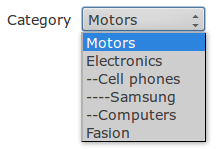

# Symfony Form Tree extension

[](https://travis-ci.org/Yavin/symfony-form-tree)

This extension provide displaying doctrine tree entity types in synfony forms. It add a prefix to option names in select list that indicates tree level.

It is tested and should work with symfony 3.0+

If want to use this in symfony 2 look at "symfony-2" branch of this extension



```html
<select name="..." data-level-prefix="-">
    <option value="1">Motors</option>
    <option value="2">Electronics</option>
    <option value="3">-Cell phones</option>
    <option value="4">--Samsung</option>
    <option value="5">-Computers</option>
    <option value="6">Fasion</option>
</select>
```

## Instalation
1. With composer.json
   ```
   composer require yavin/symfony-form-tree:^1.0
   ```

2. Add type guesser in your services file (**optional**):
   ```xml
   <service class="Yavin\Symfony\Form\Type\TreeTypeGuesser">
       <argument type="service" id="doctrine"/>
       <tag name="form.type_guesser"/>
   </service>
   ```

   or if you use `yml` format:
   ```yml
   services:
       symfony.form.type_guesser.tree:
           class: Yavin\Symfony\Form\Type\TreeTypeGuesser
           arguments: [ "@doctrine" ]
           tags:
               - { name: form.type_guesser }
   ```
3. Then add field to tree model. In this example
    ```php
    use Yavin\Symfony\Form\Type\TreeType;

    public function buildForm(FormBuilderInterface $builder, array $options)
    {
        $builder->add('category'); //extension will guess field type

        //or this is full example with default options:

        $builder->add('category', TreeType::class, [
            'class' => Category::class, // tree class
            'levelPrefix' => '-',
            'orderFields' => ['treeLeft' => 'asc'],
            'prefixAttributeName' => 'data-level-prefix',
            'treeLevelField' => 'treeLevel',
        ]);
    }
    ```

    This extension assume that in tree model You have `treeLeft` and `treeLevel` fields.
    It can be changed in field options.

    [Here](tests/Fixtures/Category.php) is example tree entity.

## Other
* [Custom, callback provided prefix](doc/custom_prefix.md)
* [Set default options to all tree select fields](doc/default_options.md)

## License
[MIT](https://opensource.org/licenses/MIT)
